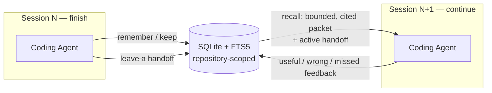
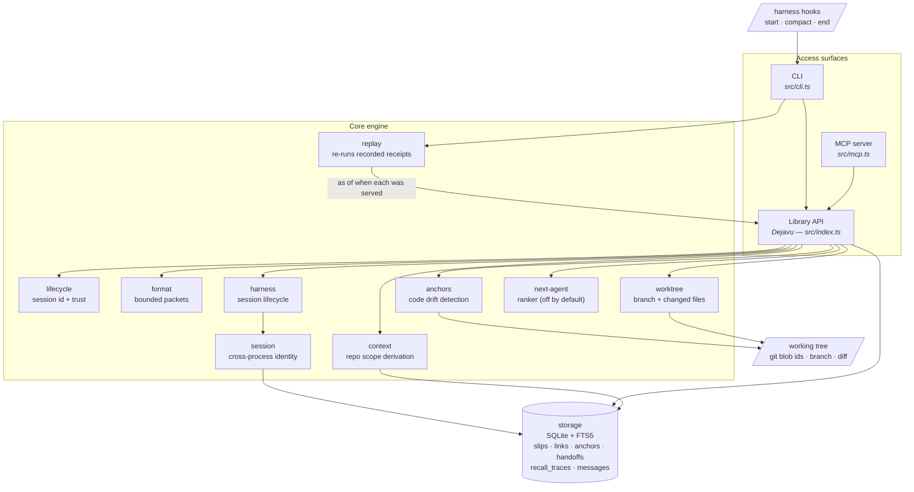
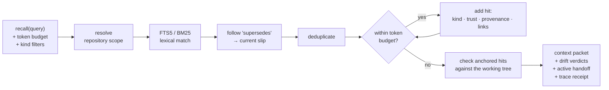
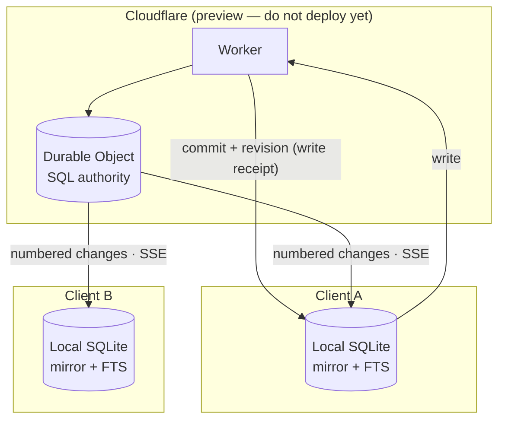

<div align="center">

<picture>
  <source media="(prefers-color-scheme: dark)" srcset="assets/dejavu.png">
  <source media="(prefers-color-scheme: light)" srcset="assets/dejavu-dark.png">
  
</picture>

<br/>

# Dejavu

<h3>Memory that lets coding agents <em>continue</em> instead of <em>start over</em></h3>

<p>
A fast, <strong>repository-scoped</strong> memory for coding agents —<br/>
stored in one inspectable <strong>SQLite</strong> file.
</p>

<p><em>Local&nbsp;·&nbsp;Bounded&nbsp;·&nbsp;Cited&nbsp;·&nbsp;Honest about uncertainty</em></p>

<br/>

[](LICENSE.md)
[](https://bun.sh)
[](tsconfig.json)
[](CHANGELOG.md)
[](#what-ships-in-v010)
[](#shared-mode--preview)

<br/>

<a href="#quick-start"><b>Quick start</b></a> &nbsp;·&nbsp;
<a href="#agent-setup-60-seconds"><b>Agent setup</b></a> &nbsp;·&nbsp;
<a href="#what-ships-in-v010"><b>Features</b></a> &nbsp;·&nbsp;
<a href="#agent-api"><b>API</b></a> &nbsp;·&nbsp;
<a href="#cli"><b>CLI</b></a>

</div>

<br/>

> **No account. No daemon. No embeddings required. No transcript dump into the prompt.**
>
> Local Dejavu is the production surface in `v0.1.0`. Shared mode is a tested preview and intentionally remains local-only until its security review is complete.

<br/>

<div align="center">

<picture>
  <source media="(prefers-color-scheme: dark)" srcset="assets/dejavu-hero-dark.png">
  <source media="(prefers-color-scheme: light)" srcset="assets/dejavu-hero-light.png">
  
</picture>

</div>

<br/>

## The problem

Coding agents repeatedly lose the expensive parts of prior work:

| | What gets lost |
|:--:|:--|
| • | the **decision** — and *why* it was made |
| • | the **command** that finally worked |
| • | the **failure mode** that must not be repeated |
| • | the **exact next step** after context compaction |
| • | the user's **project-specific preference** |

A notes database is not enough. Real agent memory must appear in the **right repository**, fit inside a **context budget**, distinguish **relevance from trust**, **stop surfacing completed work**, and **expose evidence** when it fails. Those constraints shape Dejavu.

<br/>

## What Dejavu is

Dejavu gives an agent a fast, **repository-scoped** memory between sessions. It stores decisions, preferences, procedures, pitfalls, facts, and work-in-progress as immutable **slips** in one inspectable **SQLite** file, indexed with **FTS5** full-text search.

<table>
<tr>
<td width="33%" valign="top">

### Local-first
One SQLite file. No account, no daemon, no cloud dependency.

</td>
<td width="33%" valign="top">

### Repository-scoped
Memory shows up in the right repo — never leaked across projects.

</td>
<td width="33%" valign="top">

### Budgeted & cited
Bounded packets with kind, trust, provenance, and links.

</td>
</tr>
</table>

<br/>

## How it works: the session loop

An agent *remembers* and leaves a *handoff* when a session ends, then *recalls* a bounded, cited packet when the next session starts — closing the loop with useful/wrong feedback.



<br/>

## Architecture

Three access surfaces (CLI, MCP server, library) share one core engine, which composes small deterministic modules over a single local SQLite store.



> **Repository isolation is the foundation.** The `context` module derives a stable scope from the nearest Git repository and its normalized `origin`, so two checkouts of the same repo share memory while unrelated projects stay isolated.

<br/>

## Recall pipeline

Recall is local, deterministic, and budget-aware. It matches, follows supersession to *current* truth, deduplicates, and stops before the packet exceeds the token budget.



<br/>

## Quick start

Dejavu currently requires [Bun](https://bun.sh).

```bash
# Add and initialize
bun add github:sanjayrohith/Dejavu
bunx github:sanjayrohith/Dejavu init
```

<details>
<summary><b>Prefer to clone the repo?</b></summary>

<br/>

```bash
git clone https://github.com/sanjayrohith/Dejavu
cd Dejavu
bun install
bun run src/cli.ts init
```

</details>

`dejavu init` creates `~/.dejavu/dejavu.db` and prints MCP configuration for Claude Code, OpenCode, and Pi.

<br/>

## Agent setup (60 seconds)

```jsonc
{
  "mcpServers": {
    "dejavu": {
      "command": "bunx",
      "args": ["github:sanjayrohith/Dejavu", "mcp"]
    }
  }
}
```

The tool descriptions **are** the operating contract. Dejavu does not require a `SKILL.md`, `AGENTS.md`, or a memory paragraph copied into every system prompt.

On Claude Code you can go one step further and stop relying on the agent remembering to call anything:

```bash
dejavu install claude-code
```

That wires orientation, checkpointing, and session close into hooks — see [Since v0.1.0](#since-v010). The manual pattern below still works, and remains the fallback for harnesses without hooks.

<table>
<tr>
<td width="50%" valign="top">

**At the beginning of work:**

```text
recall("")
```

</td>
<td width="50%" valign="top">

**At the end:**

```text
handoff({
  summary: "Implemented scoped auth",
  next: ["run the remote smoke test"]
})
```

</td>
</tr>
</table>

<br/>

## What ships in v0.1.0

### Repository isolation by default

Dejavu derives a stable scope from the nearest Git repository and its normalized `origin`. Two checkouts of the same repository share a scope; unrelated repositories do not leak slips or handoffs into each other.

Use `DEJAVU_SCOPE=global` deliberately for a cross-project preference. Global slips may match any repository query, but global handoffs never direct repository work. Databases created before scoping migrate safely to `legacy:global` and are excluded unless `DEJAVU_INCLUDE_LEGACY=1` is set during migration.

### Typed memory without filing work

Every slip has exactly one kind:

| Kind | Use it for |
|---|---|
| `decision` | A choice that constrains future work |
| `preference` | A user or project preference |
| `procedure` | A reusable, verified sequence |
| `pitfall` | A failure, sharp edge, or thing not to repeat |
| `fact` | A verified project-specific finding |
| `wip` | Current work, blockers, and next steps |
| `note` | Safe fallback for everything else |

> Agents may set the kind. If they don't, Dejavu uses a conservative deterministic heuristic — **never** a hidden model call.

### Bounded context packets

```ts
const result = d.recall("deploy staging", {
  limit: 8,
  maxTokens: 700,
  kinds: ["decision", "procedure", "pitfall"],
});
```

Dejavu retrieves locally, follows explicit supersession to current memory, deduplicates, and stops before the packet grows beyond the budget. Each hit carries its kind, provenance, evidence trust, and links.

### Trust is not relevance

BM25 answers **"does this text match?"** — not **"is this true?"** Dejavu keeps those concepts separate:

| Trust | Meaning |
|---|---|
| `low` | Draft or disputed; verify before relying on it |
| `medium` | Kept, but not yet confirmed through use |
| `high` | Kept and materially useful at least twice |

> Mutable facts should still be checked against live code and systems. Dejavu never labels a lexical match "authoritative."

### Current truth without rewriting history

Slips are immutable. A correction creates a new slip and links it:

```ts
const old = d.remember("Use Jest", { kind: "decision" });
const current = d.remember("Use Vitest", {
  kind: "decision",
  links: [{ toId: old.id, kind: "supersedes" }],
});
```

Recall follows `supersedes` to the current slip. `contradicts` keeps both claims visible. The history remains inspectable.

### Handoffs that stop when work stops

A handoff is an active *continuation packet*, not a permanent instruction:

```ts
const h = d.handoff({
  summary: "Auth refactor is implemented but not deployed.",
  next: ["run integration tests", "deploy canary"],
});

// Later:
d.resolveHandoff(h.id, "completed");
```

Only active, repository-scoped handoffs appear in normal recall. Resolved or abandoned work no longer directs the next agent. An unresolved handoff older than three days is labeled **stale** and advisory, so an agent verifies it before acting.

### A measurable feedback loop

By default, each recall returns a content-free receipt id. After acting, an agent can assess the retrieval:

```ts
const result = d.recall("test runner");
d.assessRecall(result.traceId, "useful");
```

| Assessment | Meaning |
|---|---|
| `useful` | The packet helped |
| `wrong` | Surfaced context was misleading |
| `missed` | Needed memory existed/should have existed but was absent |
| `no_memory_needed` | Not a memory-shaped task |

The trace stores query, scope, returned IDs, handoff ID, session, author, and timestamp — but **not** memory text or transcripts. Library callers handling sensitive queries may disable trace storage with `recordRecallTraces: false` (those calls return `traceId: null`). `dejavu eval` reports scoped evidence so retrieval changes can be evaluated against real use.

<br/>

## Since v0.1.0

On `main`, not yet tagged. Both are additive: existing databases and unanchored memory behave exactly as before.

### Memory that knows when its code moved

A memory's age tells you almost nothing about whether it is still true. What matters is whether the code it describes changed underneath it — and git already knows.

Anchor a memory to the code it is about:

```ts
d.remember("refreshToken double-refreshes inside the middleware", {
  kind: "pitfall",
  anchors: ["src/auth.ts:42#refreshToken"],
});
```

Dejavu records the file's **git blob id** at write time. Every later recall recomputes it and reports the verdict:

| Status | Meaning |
|---|---|
| `verified` | The anchored file is byte-identical to when the memory was written |
| `drifted` | The file still exists, but its contents changed |
| `orphaned` | The anchored path is gone |
| `unknown` | Could not be checked — outside a checkout, unreadable, or too large |

```text
- **[medium — kept, not yet confirmed]** 01M05… · pitfall · CODE CHANGED — verify before relying on this
  refreshToken double-refreshes inside the middleware
  anchors: src/auth.ts#refreshToken — drifted
```

> Drift is a **label**, not a ranking input. It never touches BM25 relevance, evidence trust, or hit order — that would be a retrieval change, and retrieval changes here have to be earned by an eval.

Anchoring also gives recall an inverse. `touching` answers *"what is known about the code I am about to change"* — a question an agent can ask before it knows what words to search for:

```ts
d.touching(["src/auth.ts", "src/billing.ts"]);
```

```bash
dejavu touching src/auth.ts
dejavu touching --diff          # whatever you have changed but not committed
dejavu anchors --drifted        # anchored memory whose code has since moved
```

The check is local, deterministic, and never calls a model. It costs roughly **0.1 ms** at p95 on an eight-hit packet — 0.07–0.14 ms across runs (`bun run bench:anchors`) — and a database with no anchored memory pays one indexed query that returns nothing.

### Memory the agent doesn't have to remember to use

Dejavu's own [Loop 4](docs/loops/2026-04-25-loop-4-cross-session-chain.md) measured the failure this addresses: a writer agent did real work, was never told to remember it, so never did — and the next agent spent **22,911 tokens re-deriving the same fact**. Loop 4's conclusion was blunt: *"the chain only works when the writer plays its part."*

Prose nudges were tried twice and ignored under task pressure, which produced the project's own design principle — **tool behaviour beats tool prose**. So the fix isn't asking the agent more nicely. It's letting the harness do it:

```bash
dejavu install claude-code        # or --global, --print, --uninstall
```

| Hook | What Dejavu does |
|---|---|
| `SessionStart` | Injects the bounded, cited memory packet — **also fires after compaction**, so the agent is re-oriented once its context is gone |
| `PreCompact` | Keeps this session's drafts and rolls up a handoff before context is lost |
| `SessionEnd` | Same, then releases the session claim |

A session hook is not the agent: it can't forget, get distracted, or decide the task is already done.

**Shared session identity.** Hooks, the MCP server, and your own shell are separate processes, and each used to invent its own session — so a hook literally could not see the agent's drafts. A harness now claims one session id per repository scope, recorded beside the database. `DEJAVU_SESSION` still wins, the claim expires after 24 h, and a missing or corrupt one falls back to the old per-process id. Side effect: `dejavu remember` typed in your terminal joins the same session as the agent.

Two boundaries held deliberately: hooks **never read the transcript** (`transcript_path` is handed to us and ignored — transcript archiving as memory is a non-goal), and hooks **never call a model**. Everything is deterministic bookkeeping over what the agent already wrote; if it wrote nothing, nothing is invented. Cold-process cost is ~40 ms (`bun run bench:session`), against Claude Code's 1.5 s session-end budget.

> This makes memory **structural rather than discretionary**. Whether it closes Loop 4's writer-side gap in real sessions is a hypothesis, not a result — it needs a Loop 5. See [`docs/bench/claims.md`](docs/bench/claims.md).

### Orientation that knows where the session is

Getting the packet to arrive is half the problem. The other half is what is in it.

That packet used to be the six most recently kept memories — and recency got *worse* as the hooks got better, because a checkpoint promotes a whole session's drafts at once. They all land on the same `kept_at`, so one busy session fills the next session's packet with its own scratch notes and evicts the preference that has been proving itself for a month.

The checkout already knows what the session is about. So orientation asks it:

```text
# orientation — branch feature/auth-refactor · 2 changed file(s)
- src/auth.ts
- src/billing.ts

# active handoff · 3h old
Auth refactor is implemented but not deployed.

next:
- run integration tests

# hazards — 2 anchored memory about the 2 file(s) you are changing, 1 about code that has since changed
- **[medium — kept, not yet confirmed]** 01M05… · pitfall · CODE CHANGED — verify before relying on this
  refreshToken double-refreshes inside the middleware
  anchors: src/auth.ts — drifted

# active work — 1 open item(s) in this repository
…

# must know — 2 standing decision(s) and preference(s); these override generic best practice
- **[high — repeatedly useful]** 01M04… · decision
  always deploy with wrangler, never the dashboard
```

Four sections, in the order a fresh agent needs them: what is known about the code already being edited (drifted first), what is open, what generic best practice would get wrong, and — last — everything else, so memory written without a `kind` is never silently dropped.

| Section | Chosen by |
|---|---|
| `hazards` | anchored to a path in `git diff --name-only HEAD`, most suspect first |
| `active work` | kind `wip`, by evidence |
| `must know` | kinds `decision`, `preference`, `pitfall`, `procedure`, by evidence |
| `also known` | everything else still kept, by evidence |

Sections draw down **one shared budget**, which the active handoff is now charged against too — a long handoff can no longer smuggle itself past the limit. Ordering inside every section is trust first and recency only as a tie-break, so the packet can never disagree with the trust label printed beside each hit.

See what your agent will actually be handed:

```bash
dejavu orient
```

Still deterministic, still local, still no model call. The branch comes out of `.git/HEAD` without a subprocess; only the diff shells out, under a 250 ms timeout and a 200-path cap. Outside a checkout — or with no git on `PATH`, or a git that hangs — the hazard section is simply absent and the rest of the packet still beats a recency list. The read costs **+3 ms p50** measured against its own `--no-worktree` control arm (`bun run bench:session`); pass `--no-worktree` to `dejavu session start` if you would rather not spawn git at all.

> Composition is proven by fixtures and the cost is measured. That this makes agents *continue better* than the recency packet did is a **hypothesis** — it needs the same real-session comparison Loop 5 owes the hooks themselves. See [`docs/bench/claims.md`](docs/bench/claims.md).

### Retrieval changes you can check before you ship them

Dejavu's rule is that retrieval changes have to be earned by an eval. Until now there was no instrument to satisfy it, and the plan for building one waited on agents choosing to call `assess` after they had already finished the task — the exact discretionary behaviour Loop 4 showed does not survive task pressure.

But every retrieval already leaves a **content-free receipt**: the query, the scope, the ids that came back, and when. So the corpus was accumulating the whole time.

```bash
dejavu eval --replay
```

```text
scope: repo:dejavu:9bea41ad8915
replayed 8 receipt(s) as of when each was served

tier          replayed  identical  reordered  changed
----------------------------------------------------
exact                6          5          0        1
approximate          2          2          –        0

agreement with what was served: exact 83.3%, approximate 100.0%

moved:
  01M07T7BE44XSB6RNDRH6FWDMZ  recall      "token refresh"          +0 -1
```

That run is real: flipping FTS from `OR` to `AND` between two queries, and replay localizing the damage to the one receipt it broke.

**As of when it was served** is what makes this honest. Slips are append-only — text is never edited, and a state change only writes `kept_at` or `expired_at` — so what a query could see at a past instant is derivable from the rows as they stand today. Nothing had to be journalled; the immutability was already the design. Handoffs reconstruct through `resolved_at`, supersession through the link's own timestamp. Without that, every memory written since would look like a retrieval improvement.

To check a change you are making, capture and compare:

```bash
dejavu eval --replay --json > before.json
# ...change retrieval...
dejavu eval --replay --json > after.json
diff before.json after.json
```

<details>
<summary><b>What it measures, and what it does not</b></summary>

<br/>

It measures **stability and coverage**, not truth. A memory can be retrieved identically every time and still be the wrong memory; only an assessment says otherwise. So a difference is **not automatically a regression** — an intentional improvement lands in the same `changed` column, and is supposed to. The number's job is to make the change visible and quantified before it ships.

Three things are not recoverable, and replay does not pretend they are:

| Not recoverable | Consequence |
|---|---|
| `used_count` / `wrong_count` — bare counters, no history | anything ordered by evidence trust replays approximately |
| the working tree at a past instant | drift labelling is suppressed rather than guessed |
| limits and token budgets — never recorded | replay asks for exactly as many hits as were served, and lifts the budget |

That last one is why the comparison is *"the top N, where N is what you got"*: it isolates what retrieval **selected** from how much of it **fitted**.

Hence two tiers. `recall`, recents, and reverse lookups replay **exact** — set and order both compared. Orientation replays **approximate** — set compared, order not, because the counters that ordered it are gone. The two are never added together into one figure.

A replayed retrieval records no receipt and never leaves this repository's scope, so replay cannot grow or leak the corpus it is measuring.

</details>

## Agent API

```ts
import { Dejavu } from "dejavu";

const d = new Dejavu();

const slip = d.remember("Decision: use Bun for repository scripts", {
  kind: "decision",
  tags: ["tooling"],
});

d.keep([slip.id]);

const recalled = d.recall("repository runtime", {
  maxTokens: 600,
  kinds: ["decision", "pitfall"],
});

if (recalled.hits[0]) d.used(recalled.hits[0].slip.id);
d.assessRecall(recalled.traceId, "useful", "avoided rechecking package scripts");

d.handoff({
  summary: "Converted scripts to Bun; tests pass.",
  next: ["update the release workflow"],
});
```

<details>
<summary><b>Full method reference</b></summary>

<br/>

**Core lifecycle**

```ts
d.remember(text, options?)          // options.anchors pins it to code
d.keep(ids)
d.recall(query, { limit?, maxTokens?, kinds? })
d.orientation({ maxTokens?, limit? })  // the packet a session should open with
d.touching(paths, { limit? })
d.handoff({ summary, next? })
d.resolveHandoff(id, "completed" | "abandoned")
```

**Evidence and correction**

```ts
d.used(slipId)
d.wrong(slipId)
d.forget(slipId)
d.link(fromId, toId, "supersedes" | "contradicts" | "related")
d.assessRecall(traceId, assessment, note?)
d.recallReport()
d.recall(query, { asOf })           // retrieve as of a past instant, for replay
d.anchorsFor(slipId)
d.anchorStates(slipId)
```

**Deliberate bulk cleanup**

```ts
d.forgetSession(sessionId) // current repository scope only
```

</details>

<br/>

## MCP tools

The local MCP server exposes two small groups.

<table>
<tr>
<td width="50%" valign="top">

**Memory**

| Tool | Purpose |
|---|---|
| `recall` | Scoped, budgeted retrieval + active handoff; empty query orients |
| `touching` | Reverse lookup: memory anchored to given files |
| `remember` | Draft/keep a typed memory; anchor, supersede, or contradict |
| `handoff` | Leave one active continuation packet |
| `resolve_handoff` | Complete or abandon a handoff |
| `signal` | Mark one slip used, wrong, or forgotten |
| `link` | Relate two existing slips |
| `assess` | Evaluate a recall receipt |

</td>
<td width="50%" valign="top">

**Local coordination**

| Tool | Purpose |
|---|---|
| `send` | Send an asynchronous local message |
| `inbox` | Read messages for an agent identity |
| `read` | Mark a message read |
| `reply` | Continue the message thread |

</td>
</tr>
</table>

> The mailbox is intentionally *not* memory truth — it is a small local coordination channel.

<br/>

## CLI

```bash
dejavu init
dejavu verify
dejavu stats

dejavu install claude-code            # wire session hooks into Claude Code
dejavu session start|checkpoint|end   # harness lifecycle (hooks call these)
dejavu session start --no-worktree    # orient without spawning git

dejavu orient                         # the packet a new session would open with
dejavu recall                         # scoped recents + active handoff
dejavu recall "deployment decision" --tokens=700 --kind=decision,pitfall
dejavu remember "Decision: deploy with Wrangler" --kind=decision --keep
dejavu handoff "Canary is live; verify logs next"
dejavu resolve <handoff-id> completed

dejavu link <new-id> supersedes <old-id>
dejavu assess <trace-id> useful "saved a repository scan"
dejavu eval                           # scoped recall-quality evidence
dejavu eval --replay                  # re-run recorded retrievals against today's code
dejavu eval --replay --json           # same, for diffing before/after a change

dejavu ls
dejavu show <slip-id>
dejavu handoffs
dejavu forget-session <session-id> --yes
```

> Destructive session cleanup requires `--yes` and is restricted to the current repository scope.

<br/>

## Storage & migration

The default database is `~/.dejavu/dejavu.db`.

<details>
<summary><b>Database tables</b></summary>

<br/>

| Table | Purpose |
|---|---|
| `slips` | Immutable memory text, kind, scope, lifecycle, evidence counts |
| `slips_fts` | Porter-stemmed FTS5 index over text and tags |
| `links` | Supersession, contradiction, and related-memory edges |
| `anchors` | Immutable pointers from a slip to code, with the blob id captured at write time |
| `handoffs` | Active/resolved continuation packets |
| `recall_traces` | Retrieval receipts and assessments, without duplicated memory text — the corpus `--replay` re-runs |
| `messages` | Local asynchronous agent mailbox |

</details>

Schema changes are additive and run automatically when Dejavu opens the database. Existing text is never rewritten during migration.

**Environment variables**

```bash
DEJAVU_DB=~/.dejavu/dejavu.db   # database path
DEJAVU_AUTHOR=pi                # provenance identity
DEJAVU_SESSION=<conversation>   # stable session; wins over any harness claim
DEJAVU_SCOPE=global             # deliberate override; normally automatic
DEJAVU_INCLUDE_LEGACY=1         # temporary pre-v0.1 migration aid
DEJAVU_COMMAND=<how to run me>  # command `dejavu install` embeds in hook config
```

Session hooks also write `sessions.json` beside the database, recording which session id each repository scope is currently writing under. It holds no memory text, expires after 24 hours, and is safe to delete — losing it costs continuity, never data. Nothing creates it unless a harness claims a session.

> **Local SQLite is plaintext.** Do not store credentials, customer data, or secrets. See [`SECURITY.md`](SECURITY.md) for the supported boundary and vulnerability-reporting guidance.

<br/>

## Shared mode — preview

Shared Dejavu uses Cloudflare infrastructure only: a Worker fronts **one Durable Object SQL database per memory space**, streams numbered committed changes over SSE, and clients keep rebuildable local SQLite/FTS mirrors.



It already proves: server commit before write receipt; immediate read-after-write in the writer's mirror; live peer updates that never block writes; contiguous revision watermarks and explicit stale state; offline catch-up; replayable hard deletion with payload redaction; bounded stream lifetimes and reauthentication points; and token-to-space isolation in local dogfood.

Run the full two-client proof locally:

```bash
./shared-server/test-local.sh
```

> **Do not deploy it yet.** Bearer-token dogfood is not a production identity system. Multi-user use still requires verified identity, revocation, content policy, audit/retention decisions, and an encryption story. The blocking review is documented in [`docs/shared-security-review.md`](docs/shared-security-review.md). See [`docs/shared-memory.md`](docs/shared-memory.md) for the protocol and [`docs/shared-memory-implementation-contract.md`](docs/shared-memory-implementation-contract.md) for invariants.

<br/>

## Project structure

```text
Dejavu/
├── src/                    # Core engine, MCP server, CLI
│   ├── index.ts            #   Dejavu library API
│   ├── storage.ts          #   SQLite + FTS5 store
│   ├── context.ts          #   repository scope derivation
│   ├── anchors.ts          #   code anchors + drift detection
│   ├── harness.ts          #   session lifecycle for agent harnesses
│   ├── worktree.ts         #   branch + diff, read cheaply and forgivingly
│   ├── session.ts          #   cross-process session identity
│   ├── lifecycle.ts        #   session id + trust helpers
│   ├── format.ts           #   bounded recall/recents packets
│   ├── replay.ts           #   re-runs recorded receipts against current code
│   ├── next-agent.ts       #   experimental ranker (off by default)
│   ├── mcp.ts              #   local MCP server
│   ├── cli.ts              #   command-line interface
│   ├── shared-authority/   #   shared-mode server authority
│   ├── shared-mirror/      #   shared-mode local mirror + SSE client
│   └── shared-client/      #   SharedDejavu client facade
├── shared-server/          # Cloudflare Worker + Durable Object (preview)
├── test/                   # Unit + integration tests
├── bench/                  # Recall latency + behavior benchmarks
├── eval/next-agent/        # Retrieval evaluation harness + retained results
├── docs/                   # Roadmap, specs, benchmark claims, loop notes
└── experiments/            # Research spikes and receipts
```

<br/>

## Evidence

Run the complete local release gate:

```bash
bun run check
```

<details>
<summary><b>What <code>bun run check</code> runs</b></summary>

<br/>

```bash
bun test ./test
bun run typecheck
bun run bench/recall.ts
bun run bench:anchors
bun run bench:session
bun run bench:behavior
```

</details>

The repository also contains:

- [`docs/bench/claims.md`](docs/bench/claims.md) — claim-to-evidence map;
- [`docs/loops/`](docs/loops/) — failed and successful agent-behavior experiments;
- [`experiments/`](experiments/) — Cloudflare shared-memory protocol receipts;
- [`experiments/MEMORY-SEAMS-2026-06-11.md`](experiments/MEMORY-SEAMS-2026-06-11.md) — Cloudflare-native Workspace, Containers, Workflows, DO, AI Gateway, Access, continuity, provider-contract, and model-compatibility experiments;
- [`eval/next-agent/`](eval/next-agent/) — a retained negative result that kept an unproven ranker from becoming default behavior.

> The eight-case lexical benchmark is a smoke test, not proof that memory improves agents. Recall receipts and baseline-vs-Dejavu session experiments are the path to stronger claims.

<br/>

## Design boundaries

Dejavu is deliberately:

- **local-first**, not remote-only;
- **lexical and deterministic by default**, not vector-first;
- **repository-scoped**, not one global memory soup;
- **append-only and auditable**, not silently self-rewriting;
- **budgeted**, not a transcript injector;
- **honest about stale state**, not eventually-consistent theater;
- **anchored to code where it can be**, so staleness is measured against the repository rather than the clock.

> Dejavu is **not** a secrets manager, generic RAG platform, team ACL product, or replacement for source control.

The complete production/share roadmap, release gates, and next feature batch live in [`docs/ROADMAP.md`](docs/ROADMAP.md). Completed work stays checked off; hypotheses remain explicitly unshipped until an eval earns them.

<br/>

<div align="center">

## License

[Proprietary](LICENSE.md) © 2026 Sanjay Rohith. All rights reserved.

<sub>Readable and reviewable, but not licensed for reuse. See [LICENSE.md](LICENSE.md); contributions are covered by [CONTRIBUTING.md](CONTRIBUTING.md).</sub>

<br/>

<sub>Built for coding agents that should remember what already worked.</sub>

</div>
