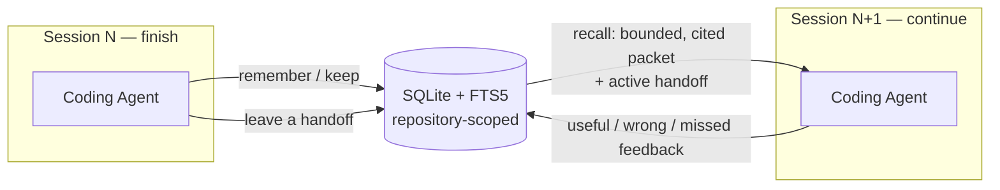
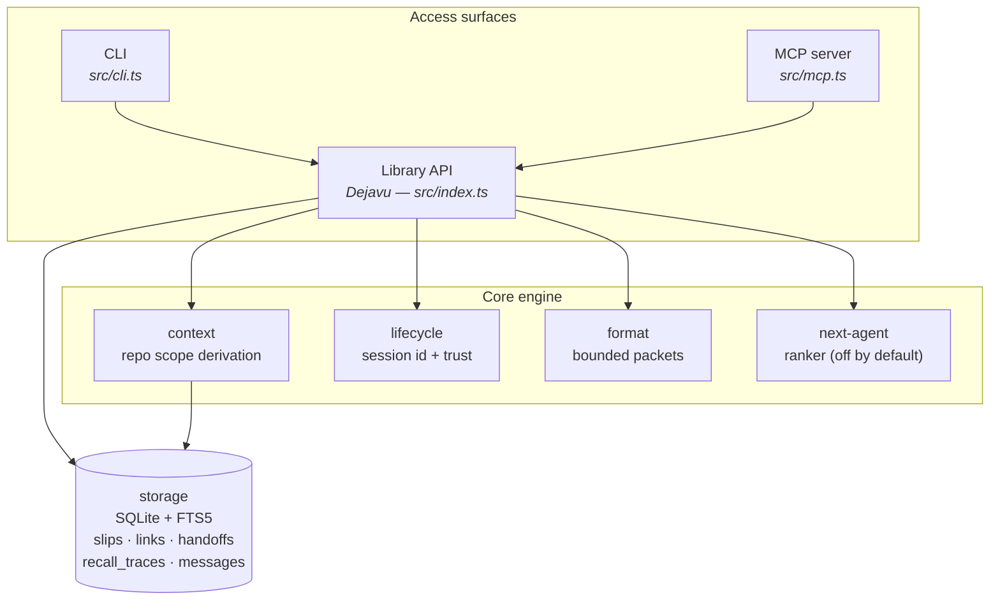
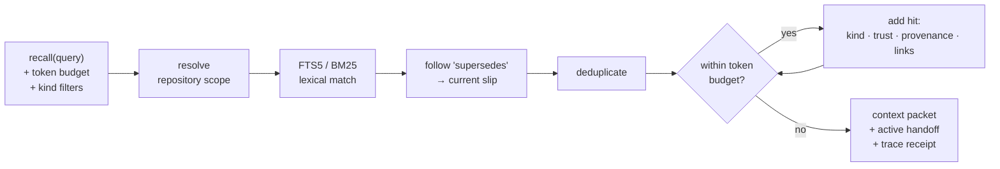
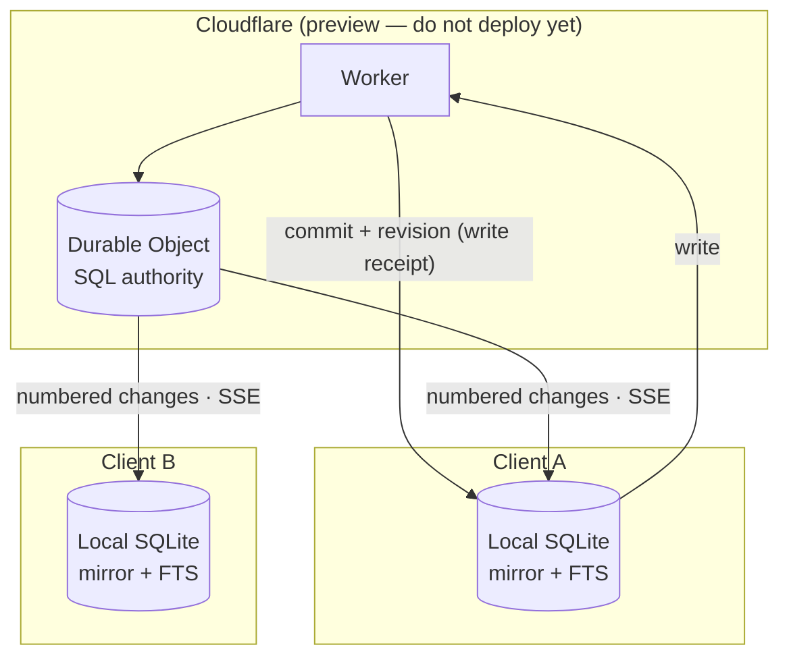

<div align="center">

<picture>
  <source media="(prefers-color-scheme: dark)" srcset="assets/dejavu.png">
  <source media="(prefers-color-scheme: light)" srcset="assets/dejavu-dark.png">
  
</picture>

<br/>

# Dejavu

<h3>Memory that lets coding agents <em>continue</em> instead of <em>start over</em></h3>

<p>
A fast, <strong>repository-scoped</strong> memory for coding agents —<br/>
stored in one inspectable <strong>SQLite</strong> file.
</p>

<p><em>Local&nbsp;·&nbsp;Bounded&nbsp;·&nbsp;Cited&nbsp;·&nbsp;Honest about uncertainty</em></p>

<br/>

[](LICENSE)
[](https://bun.sh)
[](tsconfig.json)
[](CHANGELOG.md)
[](#what-ships-in-v010)
[](#shared-mode--preview)

<br/>

<a href="#quick-start"><b>Quick start</b></a> &nbsp;·&nbsp;
<a href="#agent-setup-60-seconds"><b>Agent setup</b></a> &nbsp;·&nbsp;
<a href="#what-ships-in-v010"><b>Features</b></a> &nbsp;·&nbsp;
<a href="#agent-api"><b>API</b></a> &nbsp;·&nbsp;
<a href="#cli"><b>CLI</b></a>

</div>

<br/>

> **No account. No daemon. No embeddings required. No transcript dump into the prompt.**
>
> Local Dejavu is the production surface in `v0.1.0`. Shared mode is a tested preview and intentionally remains local-only until its security review is complete.

<br/>

<div align="center">

<picture>
  <source media="(prefers-color-scheme: dark)" srcset="assets/dejavu-hero-dark.png">
  <source media="(prefers-color-scheme: light)" srcset="assets/dejavu-hero-light.png">
  
</picture>

</div>

<br/>

## The problem

Coding agents repeatedly lose the expensive parts of prior work:

| | What gets lost |
|:--:|:--|
| • | the **decision** — and *why* it was made |
| • | the **command** that finally worked |
| • | the **failure mode** that must not be repeated |
| • | the **exact next step** after context compaction |
| • | the user's **project-specific preference** |

A notes database is not enough. Real agent memory must appear in the **right repository**, fit inside a **context budget**, distinguish **relevance from trust**, **stop surfacing completed work**, and **expose evidence** when it fails. Those constraints shape Dejavu.

<br/>

## What Dejavu is

Dejavu gives an agent a fast, **repository-scoped** memory between sessions. It stores decisions, preferences, procedures, pitfalls, facts, and work-in-progress as immutable **slips** in one inspectable **SQLite** file, indexed with **FTS5** full-text search.

<table>
<tr>
<td width="33%" valign="top">

### Local-first
One SQLite file. No account, no daemon, no cloud dependency.

</td>
<td width="33%" valign="top">

### Repository-scoped
Memory shows up in the right repo — never leaked across projects.

</td>
<td width="33%" valign="top">

### Budgeted & cited
Bounded packets with kind, trust, provenance, and links.

</td>
</tr>
</table>

<br/>

## How it works: the session loop

An agent *remembers* and leaves a *handoff* when a session ends, then *recalls* a bounded, cited packet when the next session starts — closing the loop with useful/wrong feedback.



<br/>

## Architecture

Three access surfaces (CLI, MCP server, library) share one core engine, which composes small deterministic modules over a single local SQLite store.



> **Repository isolation is the foundation.** The `context` module derives a stable scope from the nearest Git repository and its normalized `origin`, so two checkouts of the same repo share memory while unrelated projects stay isolated.

<br/>

## Recall pipeline

Recall is local, deterministic, and budget-aware. It matches, follows supersession to *current* truth, deduplicates, and stops before the packet exceeds the token budget.



<br/>

## Quick start

Dejavu currently requires [Bun](https://bun.sh).

```bash
# Add and initialize
bun add github:sanjayrohith/Dejavu
bunx github:sanjayrohith/Dejavu init
```

<details>
<summary><b>Prefer to clone the repo?</b></summary>

<br/>

```bash
git clone https://github.com/sanjayrohith/Dejavu
cd Dejavu
bun install
bun run src/cli.ts init
```

</details>

`dejavu init` creates `~/.dejavu/dejavu.db` and prints MCP configuration for Claude Code, OpenCode, and Pi.

<br/>

## Agent setup (60 seconds)

```jsonc
{
  "mcpServers": {
    "dejavu": {
      "command": "bunx",
      "args": ["github:sanjayrohith/Dejavu", "mcp"]
    }
  }
}
```

The tool descriptions **are** the operating contract. Dejavu does not require a `SKILL.md`, `AGENTS.md`, or a memory paragraph copied into every system prompt.

<table>
<tr>
<td width="50%" valign="top">

**At the beginning of work:**

```text
recall("")
```

</td>
<td width="50%" valign="top">

**At the end:**

```text
handoff({
  summary: "Implemented scoped auth",
  next: ["run the remote smoke test"]
})
```

</td>
</tr>
</table>

<br/>

## What ships in v0.1.0

### Repository isolation by default

Dejavu derives a stable scope from the nearest Git repository and its normalized `origin`. Two checkouts of the same repository share a scope; unrelated repositories do not leak slips or handoffs into each other.

Use `DEJAVU_SCOPE=global` deliberately for a cross-project preference. Global slips may match any repository query, but global handoffs never direct repository work. Databases created before scoping migrate safely to `legacy:global` and are excluded unless `DEJAVU_INCLUDE_LEGACY=1` is set during migration.

### Typed memory without filing work

Every slip has exactly one kind:

| Kind | Use it for |
|---|---|
| `decision` | A choice that constrains future work |
| `preference` | A user or project preference |
| `procedure` | A reusable, verified sequence |
| `pitfall` | A failure, sharp edge, or thing not to repeat |
| `fact` | A verified project-specific finding |
| `wip` | Current work, blockers, and next steps |
| `note` | Safe fallback for everything else |

> Agents may set the kind. If they don't, Dejavu uses a conservative deterministic heuristic — **never** a hidden model call.

### Bounded context packets

```ts
const result = d.recall("deploy staging", {
  limit: 8,
  maxTokens: 700,
  kinds: ["decision", "procedure", "pitfall"],
});
```

Dejavu retrieves locally, follows explicit supersession to current memory, deduplicates, and stops before the packet grows beyond the budget. Each hit carries its kind, provenance, evidence trust, and links.

### Trust is not relevance

BM25 answers **"does this text match?"** — not **"is this true?"** Dejavu keeps those concepts separate:

| Trust | Meaning |
|---|---|
| `low` | Draft or disputed; verify before relying on it |
| `medium` | Kept, but not yet confirmed through use |
| `high` | Kept and materially useful at least twice |

> Mutable facts should still be checked against live code and systems. Dejavu never labels a lexical match "authoritative."

### Current truth without rewriting history

Slips are immutable. A correction creates a new slip and links it:

```ts
const old = d.remember("Use Jest", { kind: "decision" });
const current = d.remember("Use Vitest", {
  kind: "decision",
  links: [{ toId: old.id, kind: "supersedes" }],
});
```

Recall follows `supersedes` to the current slip. `contradicts` keeps both claims visible. The history remains inspectable.

### Handoffs that stop when work stops

A handoff is an active *continuation packet*, not a permanent instruction:

```ts
const h = d.handoff({
  summary: "Auth refactor is implemented but not deployed.",
  next: ["run integration tests", "deploy canary"],
});

// Later:
d.resolveHandoff(h.id, "completed");
```

Only active, repository-scoped handoffs appear in normal recall. Resolved or abandoned work no longer directs the next agent. An unresolved handoff older than three days is labeled **stale** and advisory, so an agent verifies it before acting.

### A measurable feedback loop

By default, each recall returns a content-free receipt id. After acting, an agent can assess the retrieval:

```ts
const result = d.recall("test runner");
d.assessRecall(result.traceId, "useful");
```

| Assessment | Meaning |
|---|---|
| `useful` | The packet helped |
| `wrong` | Surfaced context was misleading |
| `missed` | Needed memory existed/should have existed but was absent |
| `no_memory_needed` | Not a memory-shaped task |

The trace stores query, scope, returned IDs, handoff ID, session, author, and timestamp — but **not** memory text or transcripts. Library callers handling sensitive queries may disable trace storage with `recordRecallTraces: false` (those calls return `traceId: null`). `dejavu eval` reports scoped evidence so retrieval changes can be evaluated against real use.

<br/>

## Agent API

```ts
import { Dejavu } from "dejavu";

const d = new Dejavu();

const slip = d.remember("Decision: use Bun for repository scripts", {
  kind: "decision",
  tags: ["tooling"],
});

d.keep([slip.id]);

const recalled = d.recall("repository runtime", {
  maxTokens: 600,
  kinds: ["decision", "pitfall"],
});

if (recalled.hits[0]) d.used(recalled.hits[0].slip.id);
d.assessRecall(recalled.traceId, "useful", "avoided rechecking package scripts");

d.handoff({
  summary: "Converted scripts to Bun; tests pass.",
  next: ["update the release workflow"],
});
```

<details>
<summary><b>Full method reference</b></summary>

<br/>

**Core lifecycle**

```ts
d.remember(text, options?)
d.keep(ids)
d.recall(query, { limit?, maxTokens?, kinds? })
d.handoff({ summary, next? })
d.resolveHandoff(id, "completed" | "abandoned")
```

**Evidence and correction**

```ts
d.used(slipId)
d.wrong(slipId)
d.forget(slipId)
d.link(fromId, toId, "supersedes" | "contradicts" | "related")
d.assessRecall(traceId, assessment, note?)
d.recallReport()
```

**Deliberate bulk cleanup**

```ts
d.forgetSession(sessionId) // current repository scope only
```

</details>

<br/>

## MCP tools

The local MCP server exposes two small groups.

<table>
<tr>
<td width="50%" valign="top">

**Memory**

| Tool | Purpose |
|---|---|
| `recall` | Scoped, budgeted retrieval + active handoff |
| `remember` | Draft/keep a typed memory; supersede or contradict |
| `handoff` | Leave one active continuation packet |
| `resolve_handoff` | Complete or abandon a handoff |
| `signal` | Mark one slip used, wrong, or forgotten |
| `link` | Relate two existing slips |
| `assess` | Evaluate a recall receipt |

</td>
<td width="50%" valign="top">

**Local coordination**

| Tool | Purpose |
|---|---|
| `send` | Send an asynchronous local message |
| `inbox` | Read messages for an agent identity |
| `read` | Mark a message read |
| `reply` | Continue the message thread |

</td>
</tr>
</table>

> The mailbox is intentionally *not* memory truth — it is a small local coordination channel.

<br/>

## CLI

```bash
dejavu init
dejavu verify
dejavu stats

dejavu recall                         # scoped recents + active handoff
dejavu recall "deployment decision" --tokens=700 --kind=decision,pitfall
dejavu remember "Decision: deploy with Wrangler" --kind=decision --keep
dejavu handoff "Canary is live; verify logs next"
dejavu resolve <handoff-id> completed

dejavu link <new-id> supersedes <old-id>
dejavu assess <trace-id> useful "saved a repository scan"
dejavu eval

dejavu ls
dejavu show <slip-id>
dejavu handoffs
dejavu forget-session <session-id> --yes
```

> Destructive session cleanup requires `--yes` and is restricted to the current repository scope.

<br/>

## Storage & migration

The default database is `~/.dejavu/dejavu.db`.

<details>
<summary><b>Database tables</b></summary>

<br/>

| Table | Purpose |
|---|---|
| `slips` | Immutable memory text, kind, scope, lifecycle, evidence counts |
| `slips_fts` | Porter-stemmed FTS5 index over text and tags |
| `links` | Supersession, contradiction, and related-memory edges |
| `handoffs` | Active/resolved continuation packets |
| `recall_traces` | Retrieval receipts and assessments, without duplicated memory text |
| `messages` | Local asynchronous agent mailbox |

</details>

Schema changes are additive and run automatically when Dejavu opens the database. Existing text is never rewritten during migration.

**Environment variables**

```bash
DEJAVU_DB=~/.dejavu/dejavu.db   # database path
DEJAVU_AUTHOR=pi                # provenance identity
DEJAVU_SESSION=<conversation>   # stable session supplied by the harness
DEJAVU_SCOPE=global             # deliberate override; normally automatic
DEJAVU_INCLUDE_LEGACY=1         # temporary pre-v0.1 migration aid
```

> **Local SQLite is plaintext.** Do not store credentials, customer data, or secrets. See [`SECURITY.md`](SECURITY.md) for the supported boundary and vulnerability-reporting guidance.

<br/>

## Shared mode — preview

Shared Dejavu uses Cloudflare infrastructure only: a Worker fronts **one Durable Object SQL database per memory space**, streams numbered committed changes over SSE, and clients keep rebuildable local SQLite/FTS mirrors.



It already proves: server commit before write receipt; immediate read-after-write in the writer's mirror; live peer updates that never block writes; contiguous revision watermarks and explicit stale state; offline catch-up; replayable hard deletion with payload redaction; bounded stream lifetimes and reauthentication points; and token-to-space isolation in local dogfood.

Run the full two-client proof locally:

```bash
./shared-server/test-local.sh
```

> **Do not deploy it yet.** Bearer-token dogfood is not a production identity system. Multi-user use still requires verified identity, revocation, content policy, audit/retention decisions, and an encryption story. The blocking review is documented in [`docs/shared-security-review.md`](docs/shared-security-review.md). See [`docs/shared-memory.md`](docs/shared-memory.md) for the protocol and [`docs/shared-memory-implementation-contract.md`](docs/shared-memory-implementation-contract.md) for invariants.

<br/>

## Project structure

```text
Dejavu/
├── src/                    # Core engine, MCP server, CLI
│   ├── index.ts            #   Dejavu library API
│   ├── storage.ts          #   SQLite + FTS5 store
│   ├── context.ts          #   repository scope derivation
│   ├── lifecycle.ts        #   session id + trust helpers
│   ├── format.ts           #   bounded recall/recents packets
│   ├── next-agent.ts       #   experimental ranker (off by default)
│   ├── mcp.ts              #   local MCP server
│   ├── cli.ts              #   command-line interface
│   ├── shared-authority/   #   shared-mode server authority
│   ├── shared-mirror/      #   shared-mode local mirror + SSE client
│   └── shared-client/      #   SharedDejavu client facade
├── shared-server/          # Cloudflare Worker + Durable Object (preview)
├── test/                   # Unit + integration tests
├── bench/                  # Recall latency + behavior benchmarks
├── eval/next-agent/        # Retrieval evaluation harness + retained results
├── docs/                   # Roadmap, specs, benchmark claims, loop notes
└── experiments/            # Research spikes and receipts
```

<br/>

## Evidence

Run the complete local release gate:

```bash
bun run check
```

<details>
<summary><b>What <code>bun run check</code> runs</b></summary>

<br/>

```bash
bun test ./test
bun run typecheck
bun run bench/recall.ts
bun run bench:behavior
```

</details>

The repository also contains:

- [`docs/bench/claims.md`](docs/bench/claims.md) — claim-to-evidence map;
- [`docs/loops/`](docs/loops/) — failed and successful agent-behavior experiments;
- [`experiments/`](experiments/) — Cloudflare shared-memory protocol receipts;
- [`experiments/MEMORY-SEAMS-2026-06-11.md`](experiments/MEMORY-SEAMS-2026-06-11.md) — Cloudflare-native Workspace, Containers, Workflows, DO, AI Gateway, Access, continuity, provider-contract, and model-compatibility experiments;
- [`eval/next-agent/`](eval/next-agent/) — a retained negative result that kept an unproven ranker from becoming default behavior.

> The eight-case lexical benchmark is a smoke test, not proof that memory improves agents. Recall receipts and baseline-vs-Dejavu session experiments are the path to stronger claims.

<br/>

## Design boundaries

Dejavu is deliberately:

- **local-first**, not remote-only;
- **lexical and deterministic by default**, not vector-first;
- **repository-scoped**, not one global memory soup;
- **append-only and auditable**, not silently self-rewriting;
- **budgeted**, not a transcript injector;
- **honest about stale state**, not eventually-consistent theater.

> Dejavu is **not** a secrets manager, generic RAG platform, team ACL product, or replacement for source control.

The complete production/share roadmap, release gates, and next feature batch live in [`docs/ROADMAP.md`](docs/ROADMAP.md). Completed work stays checked off; hypotheses remain explicitly unshipped until an eval earns them.

<br/>

<div align="center">

## License

[MIT](LICENSE) © Sanjay Rohith

<br/>

<sub>Built for coding agents that should remember what already worked.</sub>

</div>
